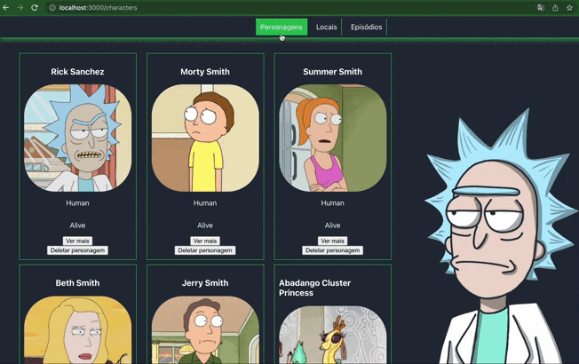
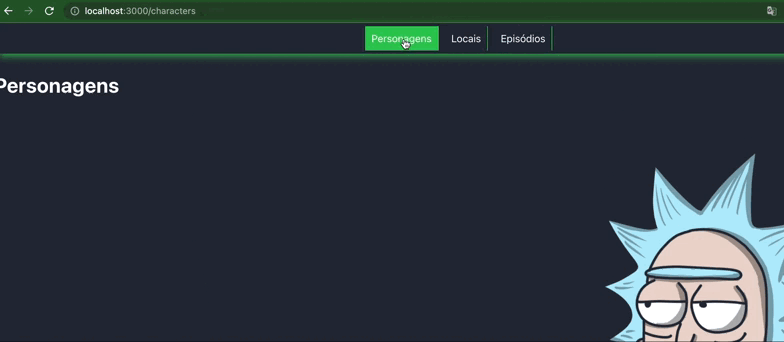
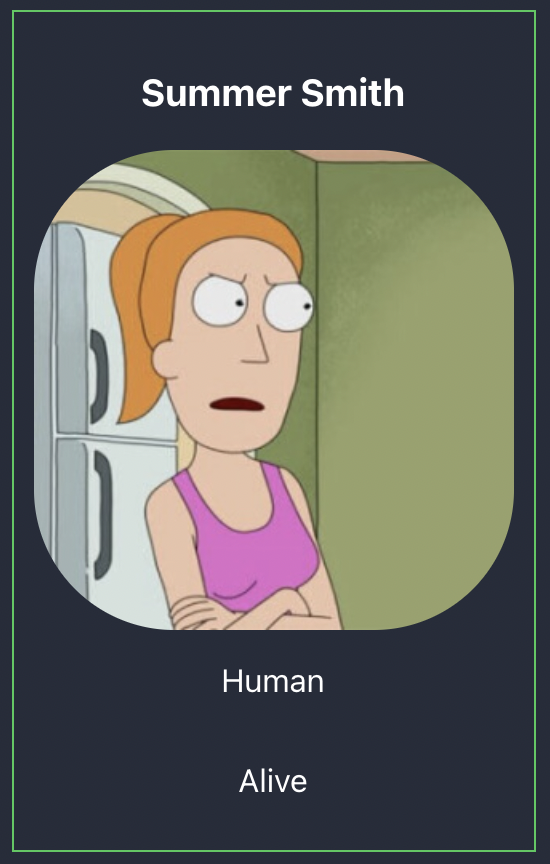
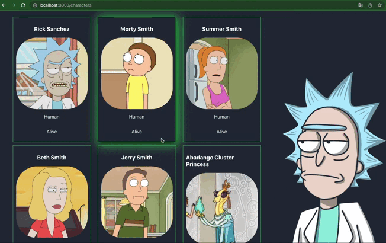
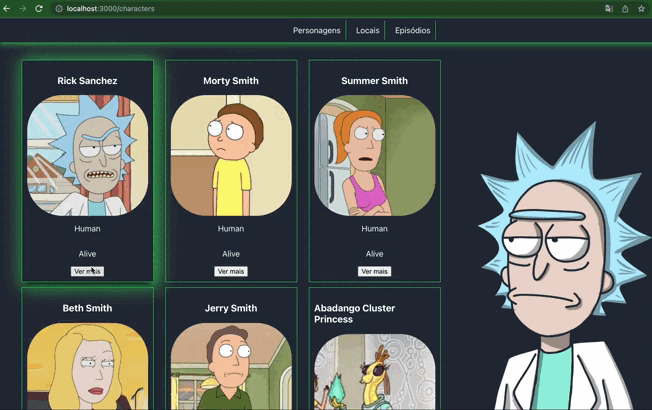
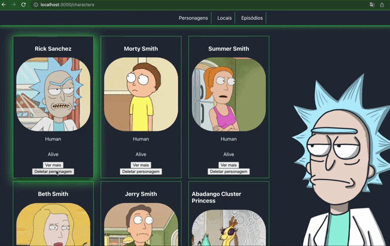

# Rick and Morty

## O que vamos desenvolver


Nesse desafio queremos que você desenvolva a aplicação acima para colocar em prática alguns conceitos de React.

### Habilidades que queremos praticar
* Criação de componentes
* Componentização
* Passagem de props
* Roteamento com React Router
* Requisições de API

Diferente dos primeiros projetos de front que são bem guiados aqui você terá mais libertade para construir sua tela, só teremos alguns pontos que precisam ser seguidos para garantir a expêriencia em desenvolver com React.

## Dicas e Avisos
* Esse desafio tem como objetivo ser executado na mentoria invertida que tem duração de 50 min, se atentem ao tempo que vão demorar para decidir o que fazer.

* Use as imagens de exemplo para se guiar. 

# Requisitos
### 1. Crie as rotas da aplicação de acordo com o gif

  - Crie as rotas: `/characters`, `/locations` e `/episodes`
  - Permita a navegão entre as rotas

### 2. Use a API para buscar dados dos personagens
  - Use o endpoint https://rickandmortyapi.com/api/character
  - Faça o log dos dados retornados da API

### 3. Edite o componente `Card` para renderizar os personagens
  - Cada componente `Card` deve renderizar apenas 1 personagem
  - Exiba as seguintes propriedades do personagem `name`, `image`, `species` e `status`.


 

### 4. Renderize todos cards de personagens na rota `/characters` de acordo com o gif


### 5. Edite o componente `Button` para deixar genérico e usar em todos os lugares que precisará de um botão
  - O botão precisará ser renderizado da seguinte maneira
  ```html
  <Button>Texto do botão</Button>
  ```

### 6. Crie a funcionadade de exibir mais informações de um personagem de acordo com o gif

 - Use rotas dinâmicas
 - Faça uma requisição em \`https://rickandmortyapi.com/api/character/${id}\` para buscar as informações do personagem
 - Exiba as seguintes propriedades do personagem `name`, `image`, `species`, `status`, `type`, `gender` `Origin` e `Location`.

### 7. Crie a funcionalidade de deletar os `Cards` dos personagens de acordo com o gif
